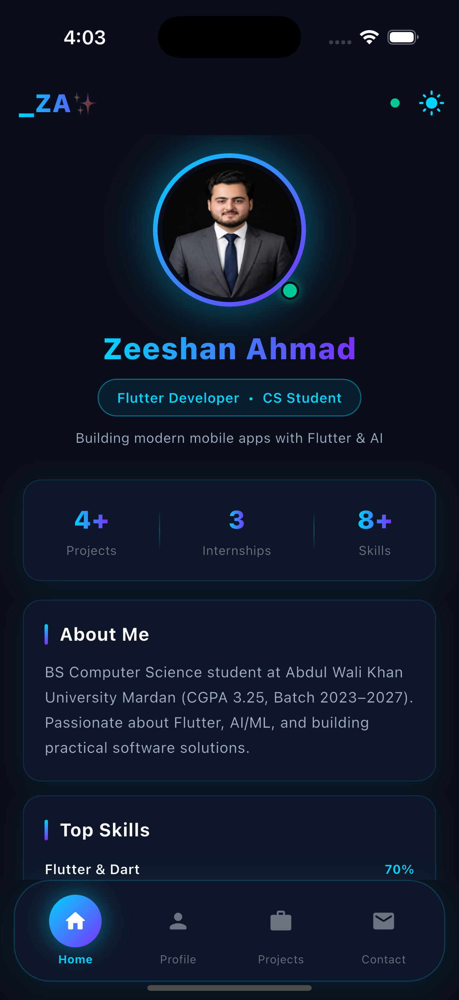
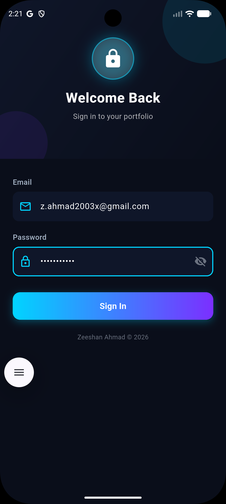
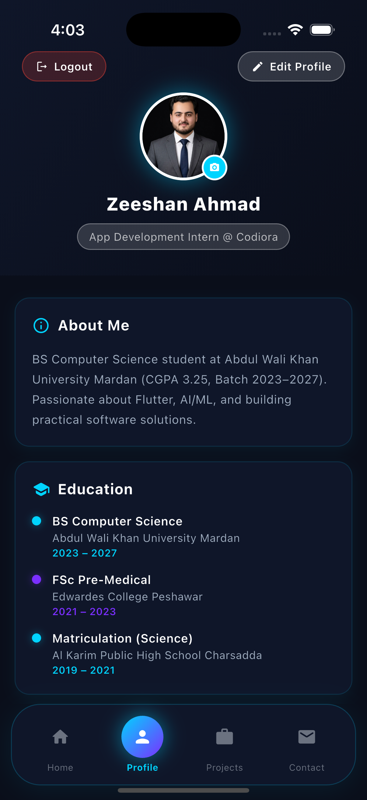
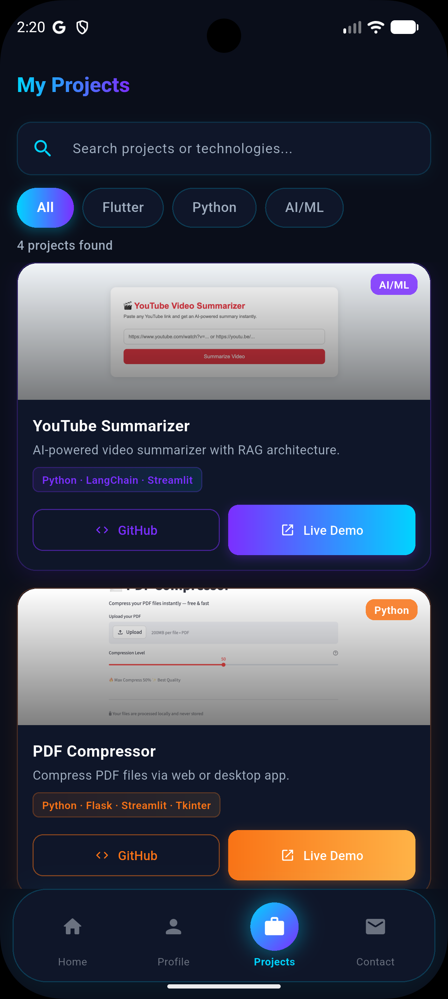
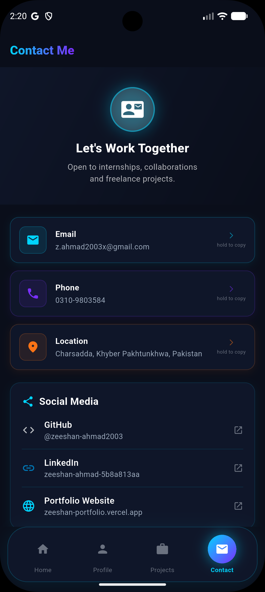

# _ZA✨ — Personal Portfolio App

A cross-platform mobile portfolio application built with Flutter, showcasing my projects, skills, and experience as a Flutter Developer and CS student. Backed by a custom Node.js/Express API with JWT authentication, offline support, and full CRUD for profile management.

**Built by:** Zeeshan Ahmad
**Internship:** App Development Intern @ Codiora Software House

---

## 📱 Screenshots

| Home | Login |
|---|---|
|  |  |

| Profile | Projects | Contact |
|---|---|---|
|  |  |  |

---

## ✨ Features

### Core
- **Dynamic Home Screen** — live profile, bio, and top skills pulled from the API
- **Authentication** — JWT-based login with secure token storage
- **Profile Management** — view and edit profile (name, bio, email, phone), with profile photo upload
- **Projects Showcase** — searchable, filterable project list with category tags and live/GitHub links
- **Contact Screen** — tap-to-email, tap-to-call, tap-to-map, with copy-to-clipboard on long press
- **Dark / Light Theme** — persists across sessions

### Reliability & Performance
- **Offline Support** — every screen falls back to cached data when the network is unavailable, with a clear "showing cached data" indicator
- **Search Race-Condition Protection** — rapid project searches never show stale results overwriting newer ones
- **Input Validation** — email format, empty fields, and image size checks before any network call
- **Graceful Error Handling** — every network call has a specific, human-readable failure message (no reachable server, timeout, bad response) with retry actions where relevant
- **Loading States** — first-load progress indicators distinct from pull-to-refresh

### Accessibility
- **Tooltips on icon-only controls** — password visibility toggle, back buttons, search-clear icon, and theme toggle all have accessible labels for screen readers

---

## 🛠 Tech Stack

**Frontend**
- Flutter & Dart
- `http` — REST API communication
- `shared_preferences` — local storage & offline cache
- `image_picker` — profile photo selection
- `url_launcher` — email, phone, maps, and external links

**Backend**
- Node.js & Express
- JWT authentication
- RESTful API (`/api/login`, `/api/profile`, `/api/projects`, `/api/skills`, `/api/contact`)
- Deployed on [Render](https://render.com) — live at `https://portfolio-backend-g3zt.onrender.com`

**Testing**
- `flutter_test` — widget and unit tests covering login validation, data persistence, API response handling, and navigation

---

## 📁 Project Structure

```
portfolio_app/
├── lib/
│   ├── main.dart                  # App entry point, theming, auth wrapper, nav
│   ├── screens/
│   │   ├── home_screen.dart
│   │   ├── login_screen.dart
│   │   ├── profile_screen.dart
│   │   ├── edit_profile_screen.dart
│   │   ├── projects_screen.dart
│   │   └── contact_screen.dart
│   └── services/
│       ├── api_service.dart       # HTTP client, JWT handling, error classification
│       └── storage_service.dart   # SharedPreferences + offline cache
├── test/
│   ├── login_screen_test.dart
│   ├── storage_service_test.dart
│   ├── api_service_test.dart
│   ├── navigation_test.dart
│   └── widget_test.dart
└── pubspec.yaml
```

> The backend now lives in its own repository: [portfolio-backend](https://github.com/zeeshan-ahmad2003/portfolio-backend), deployed independently on Render.

---

## 🚀 Installation Guide

### Prerequisites
- [Flutter SDK](https://docs.flutter.dev/get-started/install) (stable channel)
- An emulator/simulator or physical device

### 1. Clone the repository
```bash
git clone https://github.com/zeeshan-ahmad2003/portfolio-app.git
cd portfolio-app
```

### 2. Install Flutter dependencies
```bash
flutter pub get
```

### 3. Run the app
```bash
flutter run
```
By default, the app connects to the live backend at `https://portfolio-backend-g3zt.onrender.com` — no local server setup needed.

**Demo login:**
- Email: `z.ahmad2003x@gmail.com`
- Password: `zeeshan2024`

### Optional: Run the backend locally
If you want to develop against the backend directly:
```bash
git clone https://github.com/zeeshan-ahmad2003/portfolio-backend.git
cd portfolio-backend
node server.js
```
The API runs on `http://localhost:3000`. To point the app at it, update `_base` in `lib/services/api_service.dart` — use `http://10.0.2.2:3000` on an Android emulator, or your Mac's local IP (`ipconfig getifaddr en0`) on a physical device.

---

## ✅ Running Tests

Run the full test suite:
```bash
flutter test
```

Run an individual test file:
```bash
flutter test test/login_screen_test.dart
flutter test test/storage_service_test.dart
flutter test test/api_service_test.dart
flutter test test/navigation_test.dart
```

Check for static analysis issues:
```bash
flutter analyze
```

---

## 🔌 API Endpoints

| Method | Route | Auth Required | Description |
|---|---|---|---|
| POST | `/api/login` | No | Authenticate and receive a JWT |
| POST | `/api/logout` | Yes | Invalidate the current token |
| GET | `/api/profile` | No | Fetch profile data |
| PUT | `/api/profile` | Yes | Update profile fields |
| PUT | `/api/profile/image` | Yes | Upload a new profile photo |
| GET | `/api/skills` | No | Fetch skills list |
| GET | `/api/projects` | No | Fetch projects (supports `category` and `search` query params) |
| GET | `/api/contact` | No | Fetch contact information |

---

## 📬 Contact

**Zeeshan Ahmad**
BS Computer Science, Abdul Wali Khan University Mardan
📧 z.ahmad2003x@gmail.com
🔗 [GitHub](https://github.com/zeeshan-ahmad2003) · [LinkedIn](https://www.linkedin.com/in/zeeshan-ahmad-5b8a813aa/) · [Portfolio](https://zeeshan-portfolio-orcin-eight.vercel.app)

---

*Built as part of the App Development Internship at Codiora Software House.*